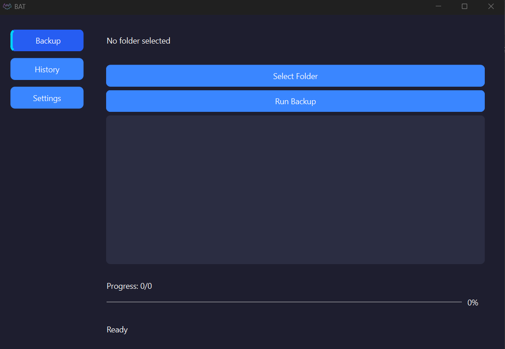
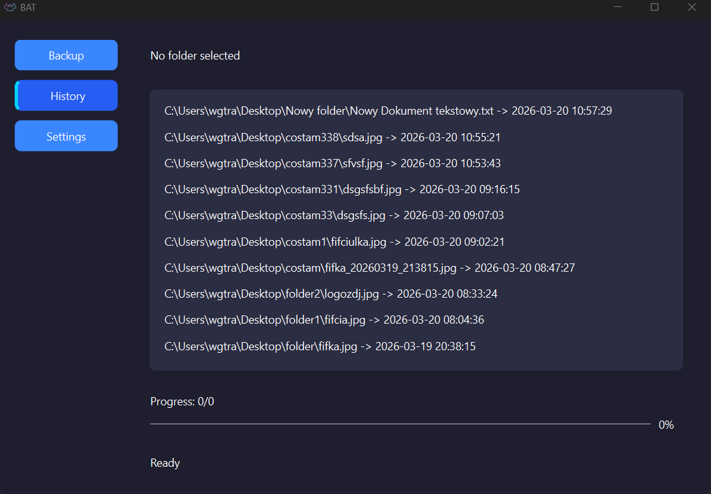
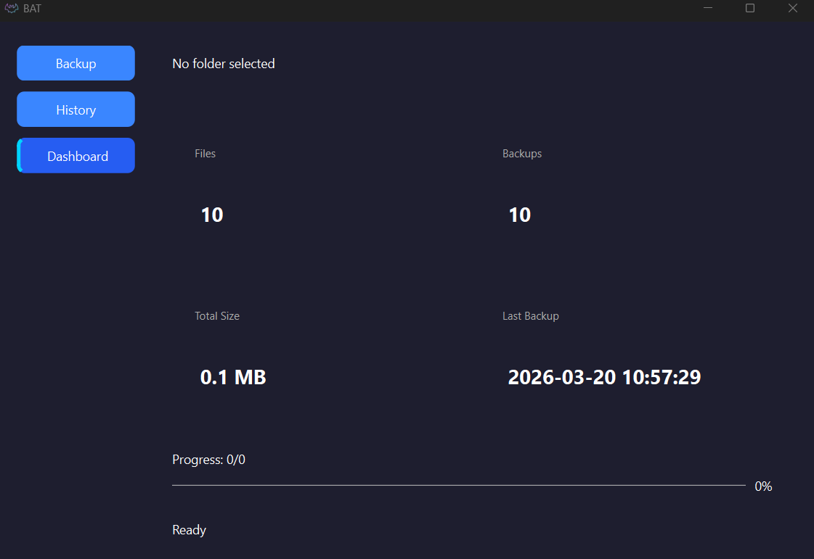

# BAT (Backup Automation Tool)

BAT is a lightweight desktop application for automatic file backups with versioning.

## Features

- Automatic backup of files and folders
- Change detection (hash-based)
- File versioning
- Backup history (SQLite)
- Restore functionality
- File filtering (.xlsx, .txt, .csv, etc.)
- Modern GUI (PySide6)
- Dashboard with statistics
- Async backup (non-blocking UI)

---

## Usage

1. Launch the application (`BAT.exe`)
2. Select a folder
3. Click **Run Backup**
4. View history in the **History** tab
5. Restore files by double-clicking an entry
6. Check statistics in the **Dashboard**

---

## Tech Stack

- Python 3
- PySide6 (Qt GUI)
- SQLite
- pathlib / shutil
- hashlib (SHA256)

---

## Screenshots

### Main


### History


### Dashboard


---

## Build (optional)

```bash
pip install pyinstaller
pyinstaller --onefile --windowed --icon=app/assets/icon.ico --paths=. --name BAT app/main.py